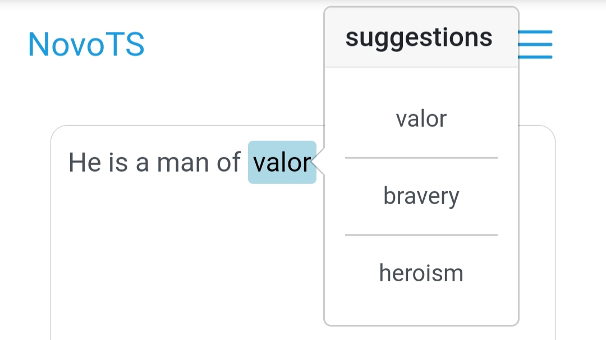
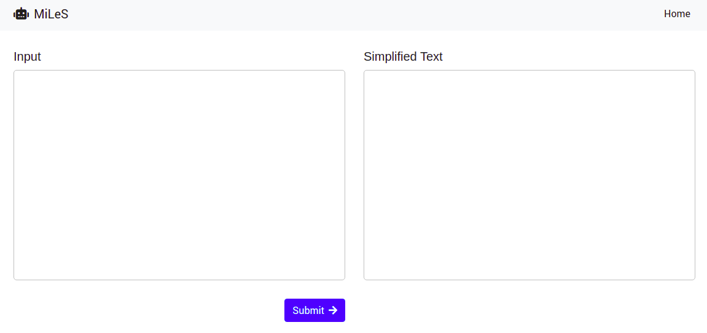

<!-- PROJECT LOGO -->
<br />
<p align="center">
  <a href="https://github.com/Kvasirs/MILES">
    
  </a>

  <h3 align="center">MILES</h3>

  <p align="center">
    MultIlingual LExical Simplifier
    <br />
    <a href="https://github.com/Kvasirs/MILES"><inspectistrong>Explore the docs »</strong></a>
    <br />
    <br />
    <a href="https://arxiv.org/abs/2006.14939">Read LSBert Paper</a>
    ·
    <a href="https://github.com/Kvasirs/MILES/issues">Report Bug</a>
    ·
    <a href="https://github.com/Kvasirs/MILES/issues">Request Feature</a>
  </p>
</p>

<!-- ABOUT THE PROJECT -->
## About The Project

MILES is a multilingual text simplifier inspired by LSBert - A lexical simplification approach proposed by Qiang et al. in 2018. Unlike LSBert, MILES makes use of the bert-base-multilingual-uncased model, as well as language-agnostic approaches to complex word identification (CWI) and candidate ranking.

MILES currently supports 22 languages: Arabic, Bulgarian, Catalan, Czech, Danish, Dutch, English, Finnish, French, German, Hungarian, Indonesian, Italian, Norwegian, Polish, Portuguese, Romanian, Russian, Spanish, Swedish, Turkish, and Ukranian. 

### Prerequisites

* [Huggingface Transformers](https://huggingface.co/transformers/)

* [Gensim](https://radimrehurek.com/gensim/)

* [NLTK](https://www.nltk.org/)

* [Wordfreq](https://pypi.org/project/wordfreq/)

* [Stop Words](https://pypi.org/project/stop-words/)

* [PyTorch](https://pytorch.org/)

* [Flask](https://flask.palletsprojects.com/en/1.1.x/)

#### FastText Embeddings

It is recommended that fastText embeddings are downloaded for your target language/s. These will be used by MILES to make notably more accurate simplifications. To install fastText embeddings for MILES, download the .vec embeddings for you target language [here](https://fasttext.cc/docs/en/crawl-vectors.html), before running the key vector generation script with the [ISO 639-1 code](https://en.wikipedia.org/wiki/List_of_ISO_639-1_codes) for the selected language. Ensure that the .vec file is in simplifier/embeddings beforehand.

```sh
python simplifier/embeddings/gen_keyed_vectors.py en
```  

## Usage

### Flask App

MILES simplifications can be done using either a simple Flask app provided or the command line. To start using the Flask app, run app.py with ISO 639-1 language code:
```sh
python app.py -l <ISO 639-1 code>
```

Once running Open 127.0.0.1 in your browser and start simplifying!



### Command Line

If you would prefer to use the command line, there are a couple of options available:

1. Simplifying sentences:
```sh
python simplify.py -t <sentence> -l <ISO 639-1 code>
```

2. Simplifying text files:
```sh
python simplify.py -f <text_file> -l <ISO 639-1 code>
```

Note: The default language is English. This can be changed in simplifier/config.py.

<!-- ROADMAP -->
## Roadmap

See the [open issues](https://https://github.com/Kvasirs/MILES/issues) for a list of proposed features (and known issues).

<!-- CONTACT -->
## Contact

If you have any questions or concerns, message me on [LinkedIn](https://www.linkedin.com/in/kane-miles-dev/) or email me at Kanemiles445@gmail.com.
